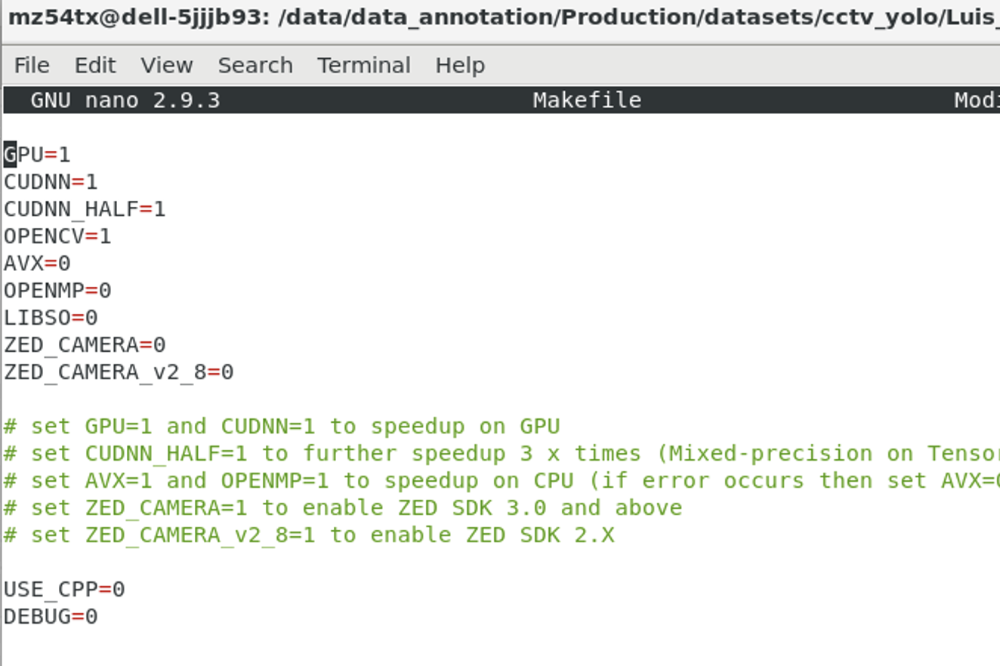
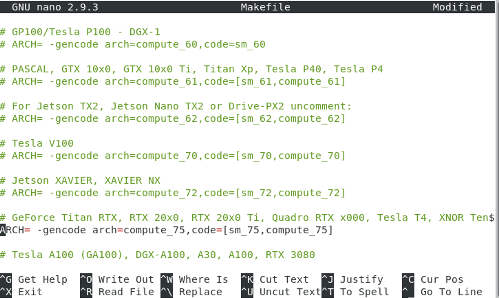
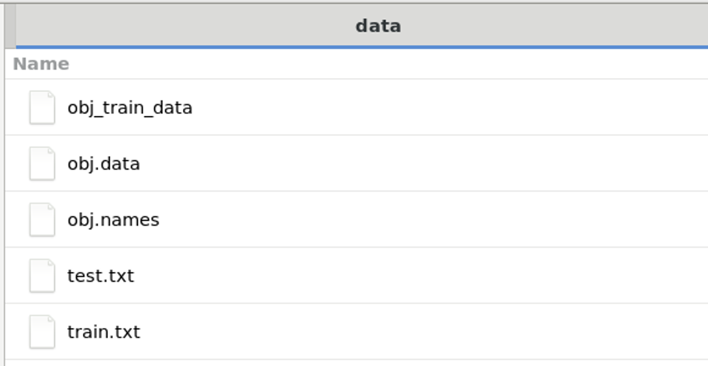
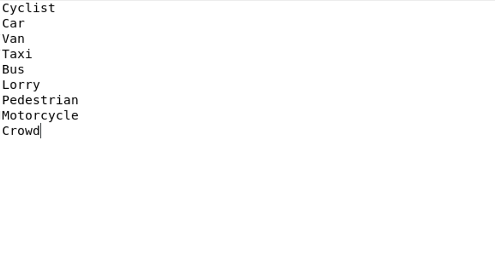
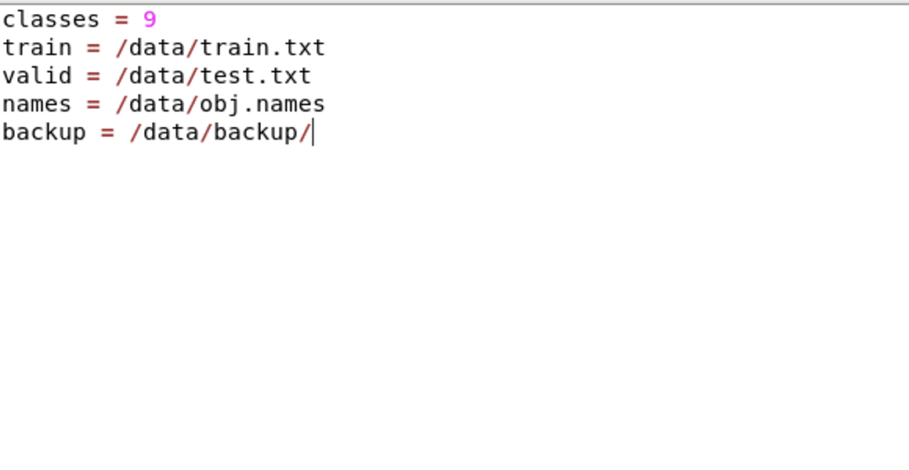
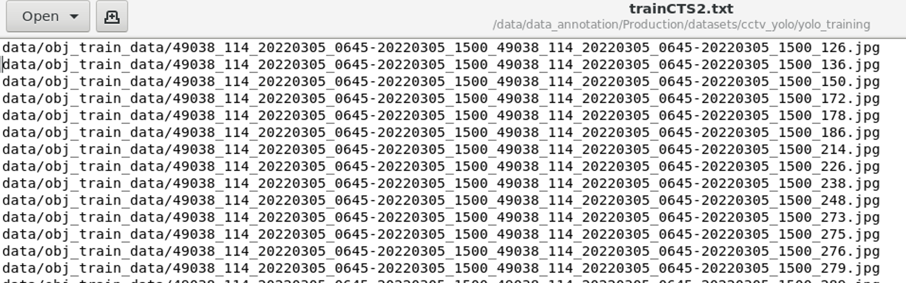
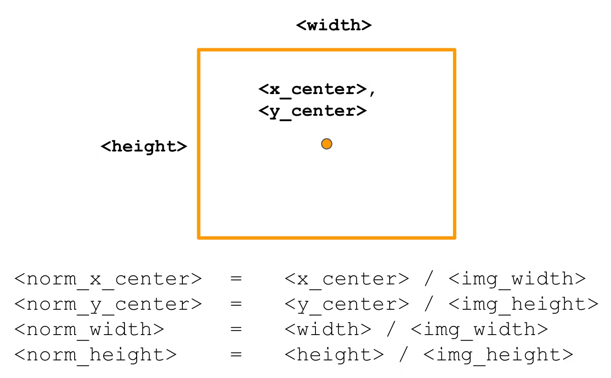
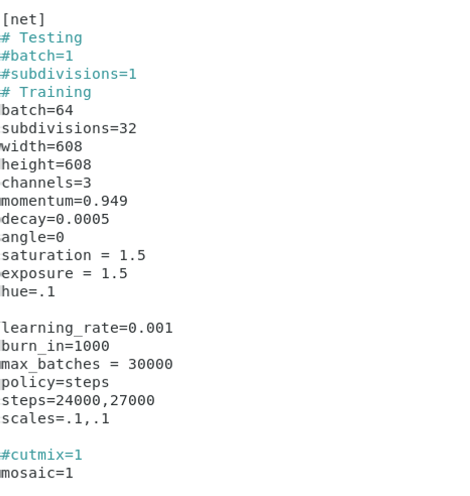
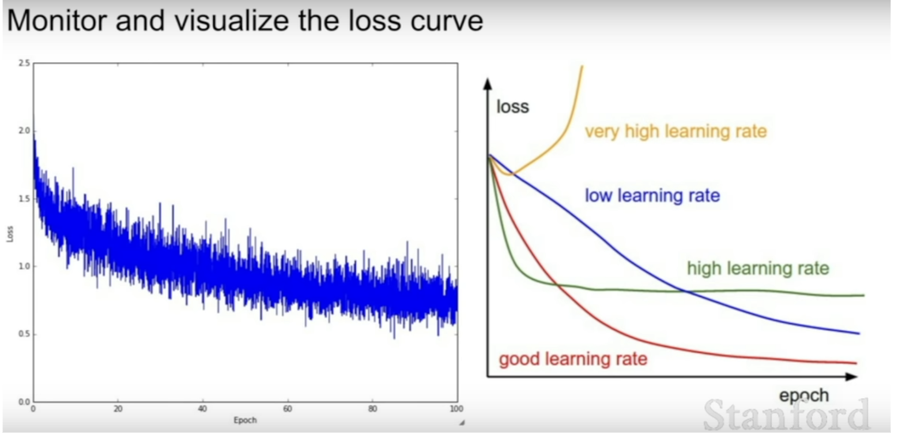

# Training customized YOLOv4 model

## 1. Setting up GPU Drivers and Environment

 **Install GPU Drivers:** 
    - Set up GPU drivers using the instructions [here](https://qiita.com/sebastianrettig/items/33ead90d3bde4cc9b6b0) for a clean installation in a separate CONDA environment.
    - Create a CONDA environment:
        ```bash
        conda create -n YOLOv4_conda python=3.7 opencv=3
        ```
    - We install the CUDA-Toolkit and the cuDNN library from the nvidia channel with the following terminal command as explained in the CUDA-Toolkit [documentation](https://docs.nvidia.com/cuda/cuda-installation-guide-linux/index.html#conda).
        ```bash
        conda install cuda cudnn -c nvidia -n YOLOv4_conda
        ```
    - Activate the environment:
        ```bash
        conda activate YOLOv4_conda
        ```

## 2. Cloning and Configuring Darknet Framework

2. **Clone and Configure Darknet Framework:**
    - Clone the repository and navigate to it in the terminal:
        ```bash
        git clone https://github.com/AlexeyAB/darknet.git
        cd darknet
        ```
    - Open and edit the Makefile, setting GPU, CUDNN, CUDNN_HALF, and OPENCV to 1.
  
      
      

    -  Line 27-58: Uncomment the compute [capability](https://developer.nvidia.com/cuda-gpus#compute) of your GPU (e.g to train with the RTX 5000 GPU, uncomment the following)
  
      

    - Build Darknet:
        ```bash
        sudo make
        ```

## 3. Dataset Preparation

3. **Prepare Dataset for Training:**
    - Create the dataset according to [Darknet documentation](https://github.com/AlexeyAB/darknet#how-to-train-to-detect-your-custom-objects) in the `/darknet/data` folder or any location within the `darknet` repository folder.
         

    - Necessary files:
        - `obj.names`: Contains class names.
          

        - `obj.data`: Information with paths to required files.
          

        - `train.txt` and `test.txt`: Lists of images for training and testing.
          

        - `obj_train_data`: Folder containing images and corresponding annotations.

    - Annotation format:
        ```
        <object-class> <x_center> <y_center> <width> <height>
        ```
    

## Download Pretrained Model and Configuration

4. **Download Pretrained Model and Configuration:**
    - Download the model:
        ```bash
        wget https://github.com/AlexeyAB/darknet/releases/download/darknet_yolo_v3_optimal/yolov4.conv.137
        ```
    - Copy `yolov4-custom.cfg` into the dataset folder:
        ```bash
        cp cfg/yolov4-custom.cfg data/
        ```
    - Customize the configuration as per the [training manual](https://github.com/AlexeyAB/darknet#how-to-train-to-detect-your-custom-objects). Basically just search with the keyword yolo for the three YOLO-layers in the config file. Then in each of the three [yolo] layers, change classes=80 into classes=9 for our nine classes dataset. Above each [yolo] layer is a [convolutional] layer where we change the filters=255 into filters=42 ((classes + 5) * 3). Finally if you want, you can change the image input width and height in the [net] layer by changing width=608 and height=608 into a size which can be divided by 32 (e.g. width=416 and height=416).
      

    
## Training the Model

5. **Train the Model:**
    - Start training:
        ```bash
        sudo ./darknet detector train /data/obj.data /data/yolov4-custom.cfg /data/yolov4.conv.137 -map
        ```
    - Monitor the training process.

    

    - Refer to [tips](https://haobin-tan.netlify.app/ai/computer-vision/object-detection/yolov4-training-tips/) for helpful insights during training.

6. **Testing the Model**
7. **Convert to TF2 Model**
